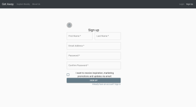
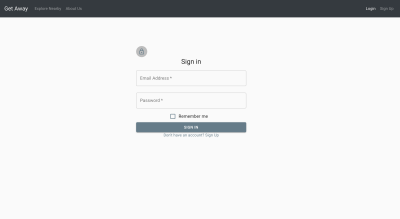
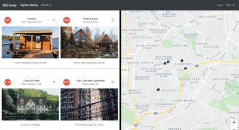
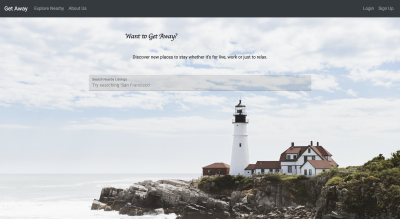
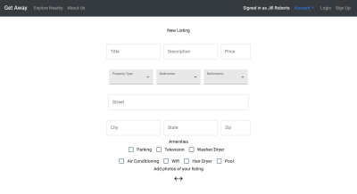
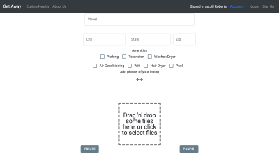
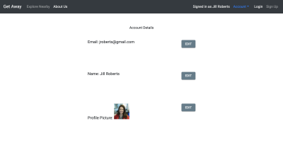
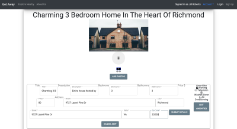
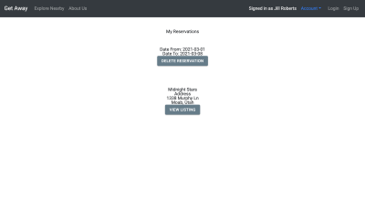
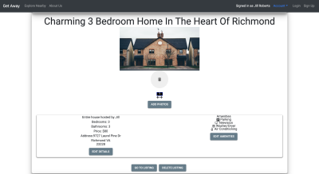

### Welcome To GetAway!

   Want to get away from the daily grind? Well with GetAWay you pretty much go wherever your heart desires!
GetAway is a platform to let you be able to rent out a house or apartment for short length of time. You can either host or rent. This website includes google maps to get a visual of where the listings are shown, a individual page for each listing to give more information on it. Full authentication to keep host and customers information with the best security possible. Also a profile to be able to see who exactly you are renting from and reviews to get that added bit peace-of-mind when do buisness with strangers. 

### `What to expect?`
*Here are a few demos to get a feel layout.*

 

### `How to use?`
**[GetAway](http://getaway.dev)**. Here we have the link to access the website!
Sign In is located in the top right corner. After that navigate to the dashboard then you proceed to either create a listing or enjoy the listings already up for grabs! 

### `FAQ's`

#### Why use GetAway?
> ##### GetAway is awesome because it gives users a great experience in being able to review and easy access   the listings they are interested in.
#### Are there refunds?
> ##### Refunds are handled at the host and customer level. We encourage all host to offer refunds!
#### Where are listings located?
> ##### Currently are listings are only located within the states, but look for future updates to include   international listings!
#### Does it cost money to use the website? 
> ##### Currently GetAway requires nothing but to register and get to vacationing! No credit card required on Sign-up.

### `About Us`

**Note: Please do not solicited or spam us !**

   Hi, we are four new developers that recently graduated from DevMountain's 13 intensive bootcamp.  
 This group project helped to give of the experence of working dillgently in a group. We learned a lot through this project on teamwork and a lot about coding! Feel free to checkout the organization.
 [Organization for GetAway] ()
 
 ##### Tessa [Github](https://github.com/tessa-woodard)
 ##### Matt  [Github](https://github.com/mattmc96)
 ##### Masen [Github](https://github.com/mfunderburk15)
 ##### Megan [Github](https://github.com/Megan-Olsen)
 
  
 
 
 
## Learn More
This is a website used for **learning** and to showcase the work of 4 young developers. 
You can learn more in the **[GetAway](http://getaway.dev/aboutus)** about us section. 
*Even though the website is fully functional the listings are demo data*

### Technologies used
- React
    - Redux
    - Material UI
    - Google Map API
- PostgreSQL
    - Massive.js
- Node
- Express

